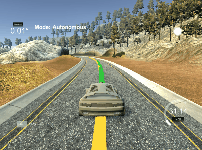
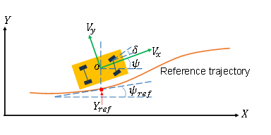

# CarND-Controls-MPC
Self-Driving Car Engineer Nanodegree Program



## Basic Build Instructions

0. Tested only on Ubuntu
1. Clone this repo.
2. Download Ipopt ```wget https://www.coin-or.org/download/source/Ipopt/Ipopt-3.12.7.zip && unzip Ipopt-3.12.7.zip && rm Ipopt-3.12.7.zip```
3. Install Ipopt ```./install_ipopt.sh```
4. Install uWs ```./install-ubuntu.sh```
2. Make a build directory: `mkdir build && cd build`
3. Compile: `cmake .. && make`
4. Run it: `./mpc`.

## The Model

This project is based on bicycle model. It is very simple and has two degrees of freedom.



Model is described by four parameters:
* x,y - position
* ψ - yaw angle
* v - speed

And has two actuators:
* δ - the drive wheel (steering angle)
* a - gas pedal (acceleration)

### Equations

The original equations of state update are looking like this:

```cpp
x += v*cos(ψ)*dt
y += v*sin(ψ)*dt
v += a * dt
psi += v/Lf * δ * dt
```

Below there is an implementation of that equations in `MPC.cpp` file

```cpp
fg[1 + x_start + t] = x1 - (x0 + v0 * CppAD::cos(psi0) * MPC::dt);
fg[1 + y_start + t] = y1 - (y0 + v0 * CppAD::sin(psi0) * MPC::dt);
fg[1 + psi_start + t] = psi1 - (psi0 + v0 * delta0 / MPC::Lf * MPC::dt);
fg[1 + v_start + t] = v1 - (v0 + a0 * MPC::dt);
fg[1 + cte_start + t] = cte1 - ((f0 - y0) + (v0 * CppAD::sin(epsi0) * MPC::dt));
fg[1 + epsi_start + t] = epsi1 - ((psi0 - psides0) + v0 * delta0 / MPC::Lf * MPC::dt);
```

The last two equations are standing for `cross-track error` and the `orientation error`.


## Timestep Length and Elapsed Duration (N & dt)

The N parameter stand for amount of predicted path points. The model with small parameter N will have faster response time, but will be less accurate and will have more overregulations.

The dt parameter stands for time between the computations: decreasing the dt is resulting in more calculations which increases the accuracy and actuator actions but also requires more of processing power.

I started with parameters from the quiz `N = 25 dt = 0.05`. The final tuning has been done by try-catch method which resulted in parameters: `N = 14 dt = 0.01`.

## Polynomial Fitting and MPC Preprocessing

The input data were converted to the vehicle coordinate system to simplfy the computing:

```cpp
Eigen::MatrixXd MPC::transformCoordinates(const vector < double > & vx,
                                          const vector < double > & vy,
                                          const double & px,
                                          const double & py,
                                          const double & psi) {
    if (vx.size() != vy.size()) {
        return Eigen::MatrixXd();
    }

    Eigen::MatrixXd result(2, vy.size());

    for (size_t i = 0; i < vx.size(); i++) {
        const double dx = vx[i] - px;
        const double dy = vy[i] - py;
        result(0, i) = dx * cos(psi) + dy * sin(psi);
        result(1, i) = -dx * sin(psi) + dy * cos(psi);
    }

    return result;
}
```

After obtaining the data in a proper coordinate system we can do the polyfitting, calculate errors, and create state vector:

```cpp
auto coeffs = polyfit(xv, yv, 3);
double cte = polyeval(coeffs, 0);
double epsi = -atan(coeffs[1]);

Eigen::VectorXd state(6);
state << 0, 0, 0, v, cte, epsi;

```

## Model Predictive Control with Latency

In real world steering the latency of the actuators must be taken into account. In the code it is simulated by artifically delay addition before sending the packet with the data. 

The latency problem is escalating along with vehicle speed: the car travels more distance in this latency window.

This problem can be solved in two ways: 
* adjusting the penalties for the parameters for perticular speeds
* create adjusted state vector with the prediction of the position

The second approach has been implemented in the `main.cpp` file.

```cpp                    
Eigen::VectorXd state(6);
const double latency_s = latency_ms/1000;
const double Lf = 2.67;
state(0) = v * latency_s * cos(psi);
state(1) = v * latency_s * sin(psi);
state(2) = v * previous_steering_angle / Lf * latency_s;
state(3) = v + previous_throttle * latency_s;
state(4) = cte - v * sin(epsi) * latency_s;
state(5) = epsi - state(2); //predict the state for Latency compenstation
```

## Sources
* https://www.mathworks.com/help/mpc/examples/autonomous-vehicle-steering-using-model-predictive-control.html